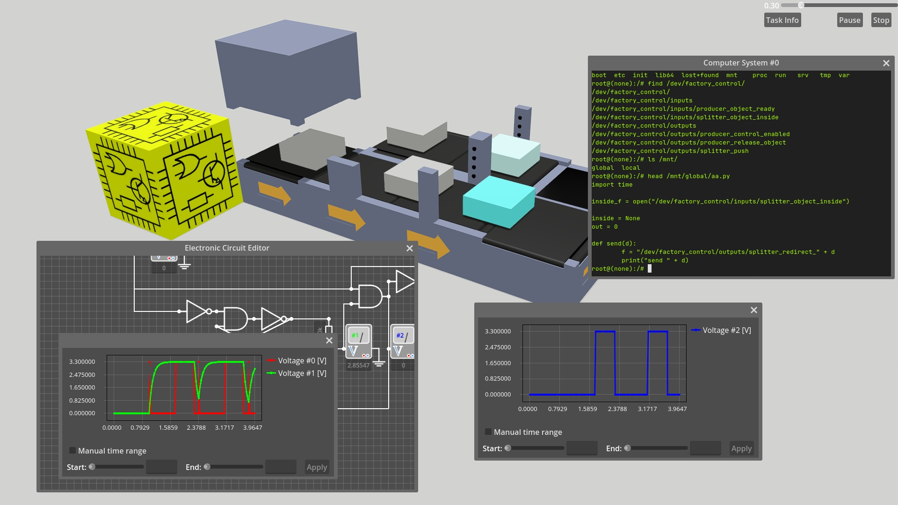

<!--
SPDX-FileCopyrightText: Robert Ryszard Paciorek <rrp@opcode.eu.org>
SPDX-License-Identifier: MIT
-->

# Factory Automation Game

[Factory Automation](https://github.com/dragons-labs/FactoryAutomationGame/) is an open-source logic game about building factory production lines and creating an automation system for them.

The game is inspired by titles such as Shapez.io, Automachef and Infinifactory. However, it puts more emphasis on creating a system to manage our production line.
Factory Automation offers, made available as part of the gameplay progression, dedicated control blocks to create advanced control systems using:

* electronic components
* programmable computers:
  * using of existing control programs from GNU/Linux operating system command line
  * creating of programs in C and Pythons
  * networking multiple computer blocks with TCP/IP

The game offers full simulation of electronic circuits (based on ngspice) and computer systems (based on QEMU and GNU/Linux). In-game manual (about basics of electronics and programming) is available. Saving the game state, customizing keys and other settings is supported.

## Project Status: Alpha-3

* All core gameplay features (like circuit simulation, computer simulation, 3d factory) are in place and works.
* There are only 3 sample tasks (levels) and a demo level available, but they do not reflect the target task layout.
* In-game manual (especially English version) requires verification.
* It's works, but may be bugged or have missing minor features.

## Build Instruction (on Linux platform)

1. clone project repository: `git clone https://github.com/dragons-labs/FactoryAutomationGame/`
2. run `just` command in project root repo directory

**Important:** This version require Godot 4.6-beta2 or higher.

You can also export project for Linux and Windows platform using `./export.sh` script (do not directly use export option in editor).
Use `./export.sh` to export amd64 Linux version or `./export.sh Windows` to export amd64 Windows version.
Results will be written to `tmp/export/`.

## License

**This project consists of materials covered by various licensing terms.**

* Project use per file [REUSE](https://reuse.software/)/SPDX type copyright info.
  * For SVG files, GDScript files, C++ sources, sh and Python scripts copyright and licence info is inside file, in comments at top of the file.
  * For Godot resources, scenes and binary files copyright and licence info is in `.licence` file.

* Main licence for this project is [MIT](LICENSE)
* Some files (code borrowed from other projects, media and resources files - like images and fonts, etc) are distributed under other licence terms.
  * Information about the license and copyright holder can be found in the REUSE header or in the `.licence` file.
  * Full text of all used licenses is included in [LICENSES](LICENSES/) directory.

* All elements used (including full supply chain and all binary distributed files) are available under [DFSG](https://www.debian.org/social_contract.pl.html#guidelines)-compatible licenses.

### Binary redistribution license information

* In addition to the above, the full binary version contains or depends on numerous other builtin or linked libraries and other resources
* Main dependencies:
  * Godot – MIT licence AND some other licenses (see https://github.com/godotengine/godot/blob/master/COPYRIGHT.txt)
  * GodotXterm – MIT licence AND some other licenses (see https://github.com/lihop/godot-xterm/blob/main/addons/godot_xterm/THIRDPARTY_NOTICES.txt)
  * easy charts – MIT licence
  * LimboConsole – MIT licence
  * GDScript Mod Loader – CC-0
  * GDCEF – MIT licence
    * CEF – BSD-3-Clause AND some other licenses from Chromium Project (see `about:credits` and https://metadata.ftp-master.debian.org/changelogs/main/c/chromium/stable_copyright)
  * ngspice – BSD-3-Clause AND some other licenses (https://metadata.ftp-master.debian.org/changelogs/main/n/ngspice/stable_copyright)
  * qemu – GPL-2.0 AND some other licenses compatible licences (see https://gitlab.com/qemu-project/qemu/-/blob/master/LICENSE and https://metadata.ftp-master.debian.org/changelogs/main/q/qemu/stable_copyright)
    * Linux kernel – GPL-2.0 WITH Linux-syscall-note
    * system disk image – multiple DFSG-compatible (see copyright info inside image → `/usr/share/doc/*/copyright`)

## Technical background

Game is created in [Godot Engine](https://godotengine.org/).

To simulate electronic circuit, the game uses:

* [ngspice](https://ngspice.sourceforge.io/)
* [easy charts](https://github.com/fenix-hub/godot-engine.easy-charts) for showing oscilloscope graphs

To simulate computer systems, the game uses:

* [QEMU](https://www.qemu.org/)
* [Debian](https://www.debian.org/) for creating operating system images, this includes but is not limited to:
  * [bash](https://www.gnu.org/software/bash/)
  * [Python](https://www.python.org/)
  * [Tiny C Compiler](https://bellard.org/tcc/)
  * [tmux](https://github.com/tmux/tmux/wiki)
  * [BusyBox](https://www.busybox.net/)
  * [zsh](https://www.zsh.org/)
  * [Linux Kernel](https://kernel.org/)
  * [GNU Coreutils](https://www.gnu.org/software/coreutils/)
  * [Clang](https://clang.llvm.org/) compilers
  * [GCC](https://gcc.gnu.org/) compilers
* [godot-xterm](https://github.com/lihop/godot-xterm) for terminal support in Godot

### Main Scripts Dependencies And Functions

## Similar open source projects

There are several FOSS projects with similar topics (games about factory build, digital logic simulation, etc), but each of them focuses on (and expands on) a certain subset of the topic covered by Factory Automation Game (FAG). However, they can be an inspiration for FAG developers as well as a source of further entertainment for players, which is why we are posting links to them here:

* [Digital-Logic-Sim](https://github.com/SebLague/Digital-Logic-Sim) (CC-BY-NC-SA-4.0, before "Version 1.0" (118f52e0) [MIT licence](https://github.com/SebLague/Digital-Logic-Sim/tree/118f52e0c329f61d3438b952c3420b72)) (Unity) and [Digital Logic Sim 2](https://github.com/UkrainianBanderasCat/Digital-Logic-Sim2) (GPL3) (Unity)
* [Logic Circuit Simulator](https://github.com/umutsevdi/Logic-Circuit-Simulator) (GPL3) (Godot)
* [OpenIndustryProject](https://github.com/Open-Industry-Project/Open-Industry-Project) (GPL3) (Godot)
* [shapez (Community Edition)](https://github.com/tobspr-games/shapez-community-edition) (GPL3) (custom engine)
