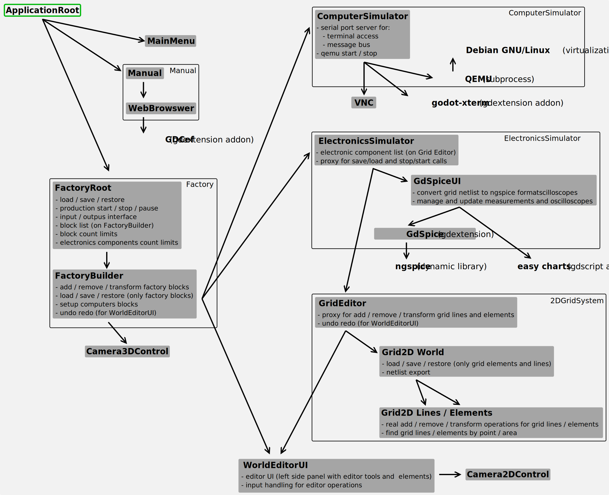

<!--
SPDX-FileCopyrightText: Robert Ryszard Paciorek <rrp@opcode.eu.org>
SPDX-License-Identifier: MIT
-->

# Factory Automation Game

Factory Automation is an open-source logic game about building factory production lines and creating an automation system for them.

The game is inspired by titles such as Shapez.io, Automachef and Infinifactory. However, it puts more emphasis on creating a system to manage our production line.
Factory Automation offers, made available as part of the gameplay progression, dedicated control blocks to create advanced control systems using:

* electronic components
* programmable computers:
  * using of existing control programs from GNU/Linux operating system command line
  * creating of programs in C and Pythons
  * networking multiple computer blocks with TCP/IP

## Project Status: Alpha-1

* All core gameplay features (like circuit simulation, computer simulation, 3d factory) are in place and works (but may be bugged or have missing minor features).
* Demo mission is playable and allow check / test core features, but is the only one mission available.
* Many things (like 3D models, icons, guide texts) are placeholders.
* It's works, but tested only under Linux and in editor mode (exporter are not configured).

## License

* Project use per file [REUSE](https://reuse.software/)/SPDX type copyright info.
  * For SVG files, gdscript files, C++ sources, sh and Python scripts copyright and licence info is inside file, in comments at begin of file.
  * For Godot resources, scenes and binary files copyright and licence info is in `.licence` file.
* Main licence for this project is [MIT](LICENSE)
* Some files (code borrowed from other projects, media and resources files - like images and fonts, etc) are distributed under other licence term – check REUSE header or `.licence` file for licence and copyright holder info.
  Full text of all used licenses is included in [LICENSES](LICENSES/) directory.
* All used elements (including full supply chain) are available under [DFSG](https://www.debian.org/social_contract.pl.html#guidelines)-compatible licenses.

### Binary redistribution license information

* In addition to the above, the full binary version contains or depends on numerous other builtin or linked libraries and other resources
* Main dependencies:
  * Godot – MIT licence AND some other licenses (see https://github.com/godotengine/godot/blob/master/COPYRIGHT.txt)
  * GodotXterm – MIT licence AND some other licenses (see https://github.com/lihop/godot-xterm/blob/main/addons/godot_xterm/THIRDPARTY_NOTICES.txt)
  * easy charts – MIT licence
  * GDCEF – MIT licence
    * CEF – BSD-3-Clause AND some other licenses from Chromium Project (see `about:credits` and https://metadata.ftp-master.debian.org/changelogs/main/c/chromium/stable_copyright)
  * ngspice – BSD-3-Clause AND some other licenses (https://metadata.ftp-master.debian.org/changelogs/main/n/ngspice/stable_copyright)
  * qemu – GPL-2.0 AND some other licenses compatible licences (see https://gitlab.com/qemu-project/qemu/-/blob/master/LICENSE and https://metadata.ftp-master.debian.org/changelogs/main/q/qemu/stable_copyright)
    * Linux kernel – GPL-2.0 WITH Linux-syscall-note
    * system disk image – multiple DFSG-compatible (see copyright info inside image → `/usr/share/doc/*/copyright`)

## Technical background

Game is created in [Godot Engine](https://godotengine.org/).

To simulate electronic circuit, the game uses:

* [ngspice](https://ngspice.sourceforge.io/)
* [easy charts](https://github.com/fenix-hub/godot-engine.easy-charts) for showing oscilloscope graphs

To simulate computer systems, the game uses:

* [QEMU](https://www.qemu.org/)
* [Debian](https://www.debian.org/) for creating operating system images, this includes but is not limited to:
  * [bash](https://www.gnu.org/software/bash/)
  * [Python](https://www.python.org/)
  * [Tiny C Compiler](https://bellard.org/tcc/)
  * [tmux](https://github.com/tmux/tmux/wiki)
  * [BusyBox](https://www.busybox.net/)
  * [zsh](https://www.zsh.org/)
  * [Linux Kernel](https://kernel.org/)
  * [GNU Coreutils](https://www.gnu.org/software/coreutils/)
  * [Clang](https://clang.llvm.org/) compilers
  * [GCC](https://gcc.gnu.org/) compilers
* [godot-xterm](https://github.com/lihop/godot-xterm) for terminal support in Godot

### Main Scripts Dependencies And Functions

